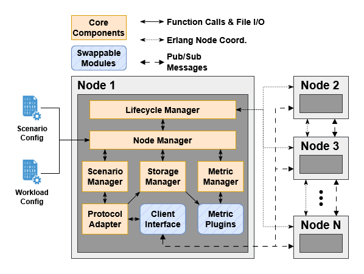
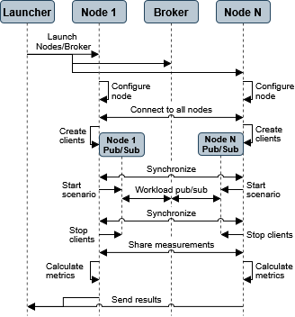

# PSMark: A distributed pub/sub IoT benchmark

PSMark is a distributed benchmark for evaluating publish/subscribe middleware in large-scale IoT deployments. It orchestrates synthetic device workloads across one or more nodes, measures end-to-end latency, throughput, and message loss, and supports both MQTT and DDS protocols.

## Key Features

- **Multi-protocol support**: MQTT v5, MQTT v3.1.1, and DDS
- **Realistic IoT workloads**: Four domain-specific scenarios with configurable device behaviors
- **Distributed execution**: Scale from single-node to multi-node deployments
- **Built-In metrics**: Latency, throughput, dropped messages, and hardware utilization
- **Pluggable architecture**: Custom protocol adapters and metric plugins

## PSMark Architecture


## PSMark Workflow


## Repository Structure

```
PSMark/
├── container_configs/              # Container-specific configuration files
│   ├── docker_files/               # Dockerfiles
│   │   └── compose_yamls/          # Docker Compose files
│   └── kubernetes_yaml/            # Example Kubernetes deployment files
├── docs/                           # Additional documentation
├── paper_results/                  # Results as reported in the PSMark paper
├── psmark/                         # Main Erlang application
│   ├── configs/
│   │   ├── builtin-test-suites/    # Built-in workloads
│   │   ├── dds_configs/            # DDS-specific configuration files
│   │   └── templates/              # Configuration templates
│   ├── include/                    # Erlang Headers
│   ├── priv/dds_cplusplus          # DDS C++ NIF Implementation
│   ├── scripts/                    # Automation scripts for Docker deployments
│   └── src/
│       ├── core/                   # Configuration, lifecycle, storage
│       ├── metrics/                # Metric plugins
│       ├── protocol_clients/       # MQTT and DDS adapters
│       └── scenario_execution/     # Scenario Management
└── run_scripts/                    # Top-level container management scripts for Docker deployments
```

## Requirements

### Docker Compose Deployments (Recommended)
- Docker Engine 28.0.4+ 
- Docker Compose 2.0+

### Kubernetes Deployments
- Kubernetes v1.33+
  
### Native Development and Execution
- Erlang/OTP 27+ (including rebar3)
- Prometheus Node Exporter v1.8.2 (Installed on brokers and PSMark nodes)
- OpenDDS v3.33.0+ (if running with DDS)
- Xerces-C++ v3.3+ (if running with DDS)

## Installation
Since Kubernetes deployments are highly tailored to the environment, we describe Docker Compose and native deployment setups here. Refer to the template Kubernetes scripts for examples of Kubernetes configuration.

### Docker Compose (Recommended)
Build and initialize the containers using the following commands:
```bash
git clone https://github.com/DAMSlabUMBC/PSMark.git
cd PSMark
./run_scripts/setup-scenarios.sh <desired_duration> <units_of_duration>
./run_scripts/build-container-images.sh
```
where `<desired_duration>` is an integer > 0 and `<units_of_duration>` is either "seconds", "minutes", or "hours".

### Native Setup (Without Docker)

If running with DDS, first follow the instructions on the Apache XML website to install Xerces-C++ (https://xerces.apache.org/xerces-c/install-3.html). Then build and install OpenDDS (https://opendds.org/).

Clone the repository:
```bash
git clone https://github.com/DAMSlabUMBC/PSMark.git
```

If running with DDS, build the DDS NIF. First update `PSMark/psmark/priv/dds_cplusplus/build.sh` with the install paths of Erlang ERTS (e.g., `/usr/lib/erlang/erts-15.2.7`) and Xerces-C++ (e.g., `/usr/lib`). Then build with
```bash
source $DDS_HOME/OpenDDS-3.33.0/setenv.sh
cd psmark/priv/dds_cplusplus
./build.sh
```

To compile the code, use:
```bash
source $DDS_HOME/OpenDDS-3.33.0/setenv.sh     # If running with DDS
cd psmark
rebar3 compile
rebar3 release
```

To run the code, first bootstrap the Erlang network (only done once per reboot) with `rebar3 shell --sname temp`. Then exit out and run the PSMark code with `rebar3 shell --config <path_to_psmark.config>`.

## Built-in Workloads

PSMark includes four IoT domain workloads derived from real-world datasets:

| Workload | Config Name | Devices | Description |
|----------|-------------|---------|-------------|
| PSMark-C | `smart_city` | 541 | Smart city sensors (meters, traffic, environment) |
| PSMark-F | `smart_factory` | 40 | Factory automation (machines, robots) |
| PSMark-HC | `smart_healthcare` | 24 | Healthcare monitoring (health sensors) |
| PSMark-HM | `smart_home` | 20 | Smart home IoT (cameras, plugs, sensors) |

Scaling variants (2x, 10x) multiply device counts proportionally.

## Supported Brokers

| Broker | Version | Compose File (One Node) |
|--------|---------|--------------|
| EMQX | 5.x | `docker-compose.single.emqx.yml` |
| Mosquitto | 2.x | `docker-compose.single.mosquitto.yml` |
| NanoMQ | 0.x | `docker-compose.single.nanomq.yml` |
| VerneMQ | 1.x | `docker-compose.single.vernemq.yml` |
| Mochi | 2.x | `docker-compose.single.mochi.yml` |

For DDS (brokerless): Use `docker-compose.single.dds.yml`

## Configuration

PSMark uses three types of Erlang configuration files in `psmark/configs/`:

### Device Definition (`*.device`)

Defines sensor behavior and publication patterns:

```erlang
[
    {type, temperature_sensor},           % Unique device type identifier
    {publication_frequency_ms, 1000},     % Publish interval (1 msg/s)
    {payload_bytes_mean, 94},             % Average payload size
    {payload_bytes_variance, 5},          % Payload size variance
    {disconnect_check_period_ms, 1000},   % Disconnect check interval
    {disconnect_chance_pct, 0.05},        % 5% disconnect probability
    {reconnect_check_period_ms, 1000},    % Reconnect check interval
    {reconnect_chance_pct, 0.8}           % 80% reconnect probability
].
```

### Deployment Definition (`*.deployment`)

Maps device types to node assignments:

```erlang
[
    {name, my_deployment_1_node},
    {nodes, [
        {runner1, [
            {devices, [
                {temperature_sensor, 10},
                {humidity_sensor, 5}
            ]}
        ]}
    ]}
].
```

### Scenario Definition (`*.scenario`)

Combines protocol, deployment, and metric settings:

```erlang
[
    {name, my_benchmark_scenario},
    {duration, {10, minutes}},
    {protocol, mqttv5},                    % mqttv5, mqttv311, or dds
    {deployment_name, my_deployment_1_node},
    {hosts, [
        {runner1, [
            {hostname, 'runner1@localhost'},
            {rng_seed, {1, 2, 3}}
        ]}
    ]},
    {protocol_config, [
        {client_interface_module, psmark_default_mqtt_interface},
        {broker, "broker"},
        {port, 1883},
        {qos, [{default_qos, 0}]}
    ]},
    {metric_config, [
        {output_dir, "results"},
        {hw_stats_poll_period_ms, 1000},
        {metric_plugins, [
            {psmark_throughput_calc_plugin, erlang},
            {psmark_latency_calc_plugin, erlang},
            {psmark_dropped_message_calc_plugin, erlang}
        ]}
    ]}
].
```

### Environment Variables

Override default settings via environment variables:

| Variable | Description | Example |
|----------|-------------|---------|
| `SCENARIO` | Scenario name to run | `scalabilitysuite_smart_home_mqttv5_1_node` |
| `BROKER_LIST` | Comma-separated broker list | `emqx,mosquitto` |
| `REPEAT_COUNT` | Number of repetitions | `4` |
| `SCEN_FILTER` | Filter scenarios by substring (Refer to "Config Name" above) | `smart_factory` |

## Running Experiments

### **A Note on Permissions**
Currently, the Docker containers are configured to run as the superuser `root` to simplify the execution of third-party broker containers. It is heavily advised to run all commands below as the `root` user or with `sudo` on the host machine to prevent permission errors.

### Quick Start: Single Benchmark Run

Run a single benchmark with a specific broker:

```bash
# Run smart_home workload with Mosquitto broker
SCENARIO=scalabilitysuite_smart_home_mqttv5_1_node \
docker compose -f container_configs/docker_files/compose_yamls/docker-compose.single.mosquitto.yml \
up --build --abort-on-container-exit
```

### Automated Test Suites

PSMark provides scripts to run complete test suites automatically:

**MQTT Scalability Suite** (QoS 0):
```bash
# Run all brokers, all scenarios, 3 repeats each
./psmark/scripts/run-single-scalability-suite.sh

# Run specific broker(s)
BROKER_LIST=emqx,mosquitto ./psmark/scripts/run-single-scalability-suite.sh

# Filter by scenario name
SCEN_FILTER=smart_factory ./psmark/scripts/run-single-scalability-suite.sh

# Change repeat count
REPEAT_COUNT=4 ./psmark/scripts/run-single-scalability-suite.sh
```

**MQTT QoS Variation Suite** (QoS 0 vs QoS 2):
```bash
./psmark/scripts/run-single-qos-suite.sh
```

**DDS Suite**:
```bash
./psmark/scripts/run-single-dds-suite.sh
```

### Multi-Node Benchmarks (5 Nodes)

```bash
# MQTT with EMQX broker
docker compose -f container_configs/docker_files/compose_yamls/docker-compose.mqtt.emqx.yml up --build

# DDS (brokerless)
docker compose -f container_configs/docker_files/compose_yamls/docker-compose.dds.yml up --build
```

### Stopping Experiments

```bash
# Stop and remove containers
docker compose -f <compose-file> down

# Remove images if needed
docker rmi psmark-runner:latest emqx-with-exporter mosquitto-with-exporter
```

## Results and Output

Results are written to `container_configs/docker_files/compose_yamls/results/` with timestamped run folders (e.g., `run_20260120_143052_runner1/`).

### Output CSV Files

Each benchmark run produces:

| File | Description |
|------|-------------|
| `throughput.csv` | Message throughput (avg, variance, min/max, P90/P95/P99) |
| `latency.csv` | End-to-end latency in milliseconds (avg, variance, min/max, P90/P95/P99) |
| `dropped_messages.csv` | Message loss (total sent/received, drop count, drop rate) |
| `local_hw_stats.csv` | Runner node CPU and memory usage |
| `broker_hw_stats.csv` | Broker node CPU and memory usage |

#### Example Output

```csv
# throughput.csv
Receiver,Sender,DurationSeconds,TotalMessagesRecv,AverageThroughput,Variance,MinThroughput,MaxThroughput,...
runner1,overall,600.02,341062,568.4,1780.5,20,604,...

# latency.csv
Receiver,Sender,SumTotalLatency,TotalMessagesRecv,AverageLatencyMs,VarianceMs,MinMs,MaxMs,...
runner1,overall,681335486365,341062,1.99,13014572.8,0.18,64.56,...
```

### Output Directories
In addition to the CSV metric results, PSMark outputs the following data for troubleshooting:
| Directory | Description |
|------|-------------|
| `broker_logs` | Log files from the broker/DDS library for troubleshooting errors |
| `raw_events` | Full logs of all client connect, disconnect, publish, and receive events. Also includes all hardware metric readings. |

## Extending PSMark

### Custom Metric Plugins

Implement an Erlang module with:
- `init(OutDir) -> ok` — Initialize with output directory
- `calc() -> ok` — Calculate and write metrics

Your plugin should output its calculations to `OutDir`.

Register in your scenario's `metric_plugins` list. See `docs/metrics-plugins.md` for details.

### Custom Protocol Adapters

Implement a `gen_server` module for MQTT or a NIF module for DDS. See `docs/interfaces.md` for the full interface specification.

## Additional Documentation

- [Metric Plugins Guide](docs/metrics-plugins.md)
- [Protocol Interfaces Guide](docs/interfaces.md)
